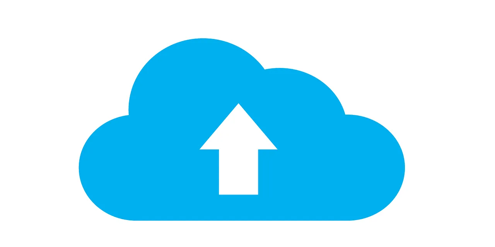

<h1 align="center" style="color: #2222ec; font-family: Roboto Mono,Consolas,Liberation Mono,Courier New,Courier,monospace;
    font-size: 55px;
    font-weight: 700;">
Invoices-XLS-Parsing
</h1>

<div align="center" color="#694e04" style="color: #694e04; font-family: Roboto Mono,Consolas,Liberation Mono,Courier New,Courier,monospace;
    font-size: 22px;
    font-weight: 500;">
Backend route with NodeJS/Express which process the XLS file, it have a single endpoint for file upload where user can pass the XLS file and parameter called “invoicingMonth” in a format YYYY-MM with the next validation and parsing.
</div>

---

<div align="center">

</div>

<div align="center" style="margin-left: auto; margin-right: auto; width: fit-content;">
<a></a>
<a></a>
<a></a>
<a></a>
<a></a>
<a></a>
</div>
---
<div align="center">
<h3>BASE URL: <a href="http://localhost:3000/upload" target="_blank" rel="noreferrer noopener">http://localhost:3000/upload</a></h3>
</div>
---

<h2 color="#22b5bf" style="color: #22b5bf; font-family: Roboto Mono,Consolas,Liberation Mono,Courier New,Courier,monospace;
    font-size: 22px;
    font-weight: 500;">Getting Started</h2>

To get started with the project, follow these steps:

1. Clone this repository to your local machine:

`git clone` [tap!](https://github.com/Ljuzifer/invoices-XLS-parsing.git)

2. Change directory to the project folder:

`cd invoices-XLS-parsing`

3.  Install the project dependencies:

`npm install`

4. Start the development server:

`npm run dev`

5. Server will start on the `http://localhost:3000` to access the application.

---

### POST ####/upload - `upload user's xlsx-file`

### form-data:

-   file: "invoicingFile"
-   text: "invoicingMonth": YYYY-MM (date in correct format)

### with response in format like:

```
{
  InvoicingMonth: “YYYY-MM” - from the file,
  currencyRates: {
    USD:
    EUR:
    GBP:
  },
  invoicesData: [
    .. all the invoices data, columns according to the file…
    ]
}
```

<h2 color="#22b5bf" style="color: #22b5bf; font-family: Roboto Mono,Consolas,Liberation Mono,Courier New,Courier,monospace;
    font-size: 22px;
    font-weight: 500;">Developer</h2>

<div align="center">
  
</div>

<div align="center">
  <h4>Created by &copy; Ljuzifer</h4>
  <a href="https://www.linkedin.com/in/ljuzifer/" target="_blank" rel="noopener norefferer">
    
  </a>
</div>
<div align='center'>
<a href="https://t.me/Ljuzifer" target="_blank" rel="noreferrer"> 
<picture> 
 
</picture> 
</a>
<a href="mailto:ljuzifer@gmail.com" target="_blank" rel="noreferrer"> 
<picture> 
 
</picture> 
</a>
</div>
